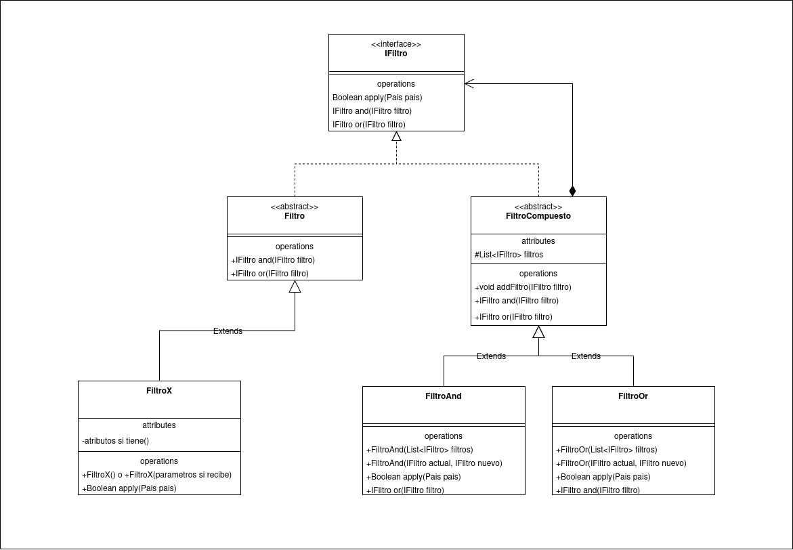

# 🌎 Filtro de Países 

## 🧠 Introducción

En este proyecto vas a trabajar con un conjunto de filtros que permiten aplicar distintos criterios para seleccionar países a partir de su información básica, como la región, el idioma, la población o si es un país insular.

Consiste en desarrollar un sistema extensible y reutilizable que permita combinar filtros de forma flexible, usando método basados en operadores lógicos como **AND** y **OR**, sin modificar la lógica interna de cada filtro. Este ejercicio está inspirado en problemas reales de clasificación y búsqueda avanzada.

# Filtros de Países

## Descripción del Proyecto

Este proyecto tiene como objetivo crear un conjunto de filtros para clasificar países según diversas características, tales como el idioma, si son islas, la población y la región. Los filtros se aplican sobre un objeto `Pais` que contiene la información relevante para cada país.

## Consigna

El sistema debe permitir aplicar distintos filtros a una lista de países para obtener aquellos que cumplen con ciertos criterios. Los filtros implementados en este proyecto incluyen:

1. **Filtro AND**: Permite combinar varios filtros utilizando el operador lógico **AND**, es decir, solo aquellos países que cumplan con todos los filtros serán seleccionados.
2. **Filtro por Idioma**: Filtra países que hablan un idioma específico.
3. **Filtro por Islas**: Filtra países que son islas.
4. **Filtro por Población**: Filtra países cuya población es mayor o igual a un número específico.
5. **Filtro por Región**: Filtra países cuya región comienza con un prefijo específico.

Cada filtro extiende la clase abstracta `Filtro`, que define un método `apply(Pais pais)` que devuelve un valor booleano indicando si un país cumple con el criterio del filtro.

